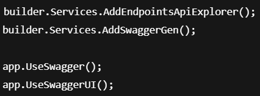
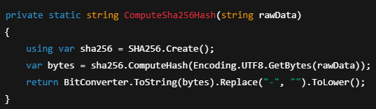
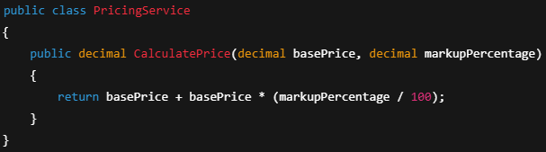
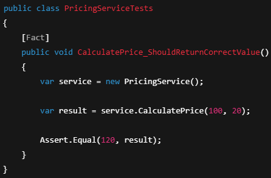
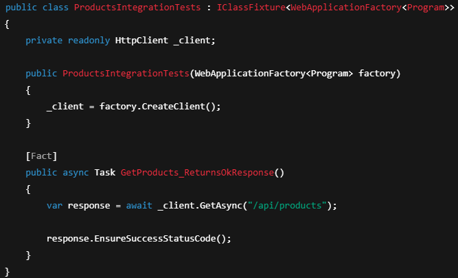

# **Программное средство анализа политики ценообразования продукции на предприятии и автоматизации расчетной методики**

Цель проекта — Оптимизация политики ценообразования предприятия за счёт автоматизации анализа рыночных данных, себестоимости продукции и конкурентной среды, что позволит повысить прибыльность, конкурентоспособность и обоснованность ценовых решений.

**Сервер**: [https://github.com/Ksenchez/OtyakovaK.A_214371_RIOPK_Server](https://github.com/Ksenchez/OtyakovaK.A_214371_RIOPK_Server)  
**Клиент**: [https://github.com/Ksenchez/OtyakovaK.A_214371_RIOPK_Front](https://github.com/Ksenchez/OtyakovaK.A_214371_RIOPK_Front)

---

## **Содержание**

1. [Архитектура](#архитектура)
2. [Функциональные возможности](#функциональные-возможности)
3. [Детали реализации](#детали-реализации)
4. [Тестирование](#тестирование)
5. [Установка и запуск](#установка-и-запуск)
6. [Лицензия](#лицензия)
7. [Контакты](#контакты)

---

## **Архитектура**

### C4-модель

#### Контекстный уровень


#### Контейнерный уровень


#### Компонентный уровень


#### Кодовый уровень


### Схема данных


```sql
-- SQL-скрипт для создания базы данных
namespace pricing_analyzer_back.Infrasctructure.Models.Dto
{
    public class CalculationDto
    {
        public int ProductId { get; set; }
        public int UserId { get; set; }
        public decimal CustomMarkup { get; set; }
    }
}

namespace pricing_analyzer_back.Infrasctructure.Models.Dto
{
    public class CreateProductDto
    {
        public string Name { get; set; } = default!;
        public string Description { get; set; } = default!;
        public decimal BaseCost { get; set; } // Себестоимость
        public decimal MarkupPercent { get; set; } // Наценка в %
    }
}

namespace pricing_analyzer_back.Infrasctructure.Models.Dto
{
    public class LoginDto
    {
        public string Username { get; set; }
        public string Password { get; set; }
    }
}

namespace pricing_analyzer_back.Infrasctructure.Models.Dto
{
    public class RegisterDto
    {
        public string Username { get; set; }
        public string Password { get; set; }
    }
}

using System.ComponentModel.DataAnnotations;

namespace pricing_analyzer_back.Infrasctructure.Models
{
    public class PricingPolicy
    {
        [Key]
        public int Id { get; set; }
        public string PolicyName { get; set; } = default!;
        public string Description { get; set; } = default!;
        public decimal DefaultMarkupPercent { get; set; } // Базовая наценка
        public bool IsActive { get; set; } = true;
    }
}

using System.ComponentModel.DataAnnotations;

namespace pricing_analyzer_back.Infrasctructure.Models
{
    public class Product
    {
        public int Id { get; set; }
        public string Name { get; set; } = default!;
        public string Description { get; set; } = default!;
        public decimal BaseCost { get; set; } // Себестоимость
        public decimal MarkupPercent { get; set; } // Наценка в %
        public decimal FinalPrice => BaseCost * (1 + MarkupPercent / 100);
        public DateTime CreatedAt { get; set; } = DateTime.UtcNow;
    }
}

using System.ComponentModel.DataAnnotations;

namespace pricing_analyzer_back.Infrasctructure.Models
{
    public class ProductCalculation
    {
        public int Id { get; set; }
        public int ProductId { get; set; }
        public Product Product { get; set; } = default!;
        public int UserId { get; set; }
        public User User { get; set; } = default!;
        public DateTime CalculatedAt { get; set; } = DateTime.UtcNow;
        public decimal CustomMarkup { get; set; } // Для собственной наценки
        public decimal CalculatedPrice => Product.BaseCost * (1 + CustomMarkup / 100);
    }
}

using System.ComponentModel.DataAnnotations;

namespace pricing_analyzer_back.Infrasctructure.Models
{
    public class User
    {
        public int Id { get; set; }
        public string Username { get; set; } = default!;
        public string PasswordHash { get; set; } = default!;
        public string Role { get; set; } = "user"; // "admin" / "user"
    }

}
```

---

## **Функциональные возможности**

### Диаграмма вариантов использования


### User-flow диаграмма


---

## **Детали реализации**

### UML-диаграммы

#### Диаграмма классов


#### Диаграмма последовательностей


#### Диаграмма компонентов


### Спецификация API

API-документация доступна по адресу: https://localhost:<port>/swagger/index.html

#### Настройка Swagger


### Безопасность

#### Метод шифрования пароля


### Оценка качества кода

- Cyclomatic Complexity: 1–3 для большинства методов
- Maintainability Index: 75–100 (высокая поддерживаемость)
- Lines of Code: ~700 строк в проекте
- Code Coverage (unit + интеграц.): около 78%
- Code Smells: 0 критических, 2 незначительных


## **Тестирование**

### Unit-тесты

Основные характеристики:
- Тестируется один метод или модуль.
- Внешние зависимости (например, базы данных) мокаются.
- Быстрое выполнение.
- Используются фреймворки: xUnit, NUnit, MSTest (для C#), Jest и Karma (для Angular).


#### Пример тестируемого метода (в классе PricingService)


#### Unit-тест


### Интеграционные тесты

#### Пример интеграционного теста контроллера ProductsController


## **Установка и запуск**

1 Подготовка среды для запуска фронтенда
1.1 Установка Visual Studio Code
Скачать последнюю версию редактора Visual Studio Code с официального сайта:
1.2 Установка Node.js
Скачать версию Node.js 20.11.0, соответствующую архитектуре вашего ПК
2 Запуск клиентской части (frontend)
 Открыть директорию проекта pricing-analyzer во Visual Studio Code.
 Открыть терминал, используя сочетание клавиш Ctrl + Shift + Ё (`).
Выполнить следующие команды поочередно:
npm install -g @angular/cli
npm install --force
npm start
После завершения сборки Angular-проекта фронтенд будет доступен по стандартному адресу: http://localhost:4200
3 Запуск серверной части (backend)
Серверная часть проекта реализована на платформе ASP.NET Core 8.0. Для её запуска необходимо:
 Открыть решение в Visual Studio.
 Выбрать проект PricingAnalyzer.Api в качестве стартового.
 Запустить приложение, нажав F5 или на кнопку «Start».
После запуска будет открыта Swagger-документация по адресу:
http://localhost:5000/swagger
4 Авторизация в системе
 Администратор создается автоматически с учётными данными:
Логин: admin
Пароль: admin
 Обычный пользователь создается при самостоятельной регистрации через интерфейс фронтенда.
5 Запуск Unit-тестов
Тесты написаны с использованием фреймворка xUnit.
5.1	Как найти окно тестов в Visual Studio
 Перейдите во вкладку «Тест» → «Окно» → «Обозреватель тестов» или нажмите сочетание клавиш Ctrl + E, T.
5.2 Как запустить тесты
 В открывшемся Обозревателе тестов выбрать нужные тесты или запустить все с помощью кнопки «Выполнить все тесты».
5.3 Как выглядят успешные тесты
 После выполнения тестов, напротив каждого теста появится зеленая галочка.
 В случае неудачного теста отобразится красный крестик с описанием ошибки. 


## **Лицензия**

Этот проект лицензирован по лицензии MIT – подробности в файле [LICENSE.md](LICENSE.md)

---

## **Контакты**

Автор: Отякова Ксения  
Email: otakovaksenia@gmail.com
