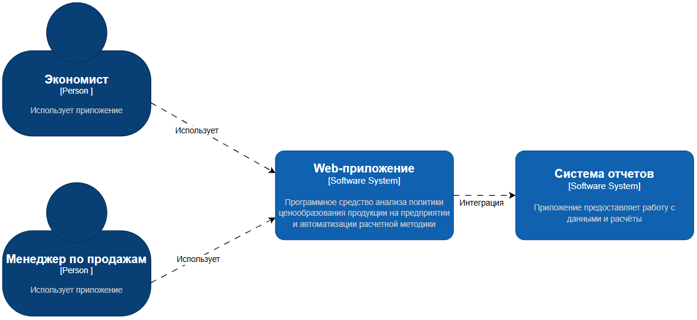
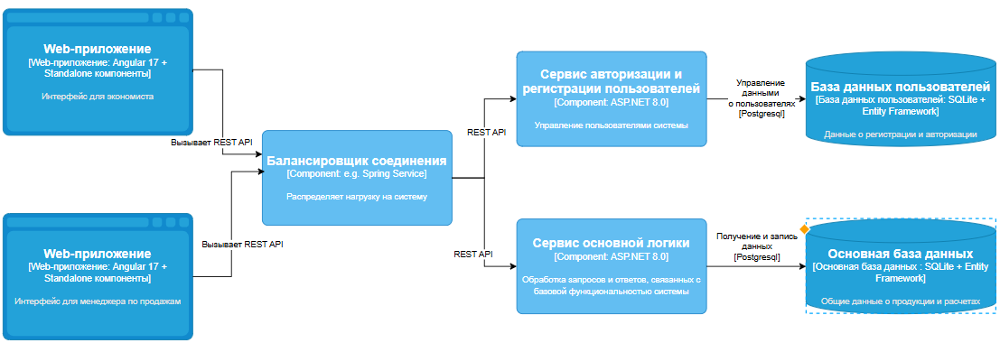
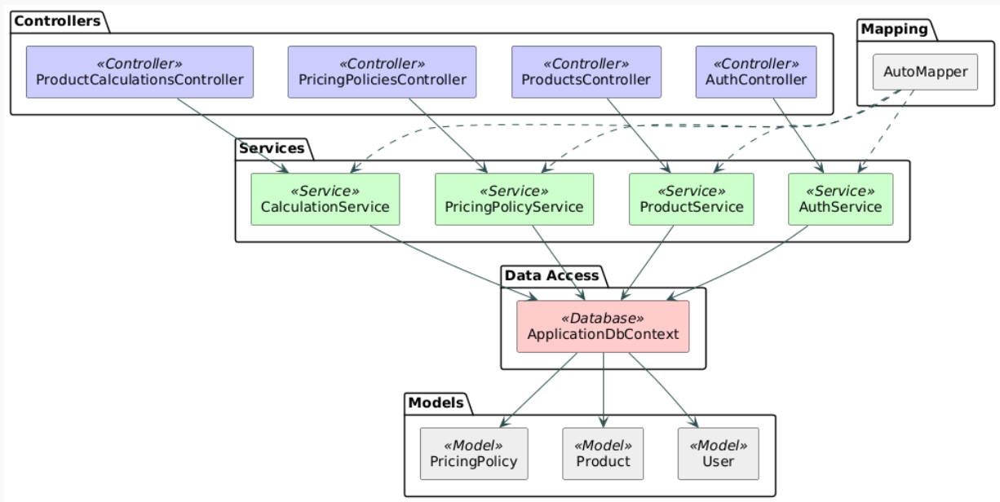
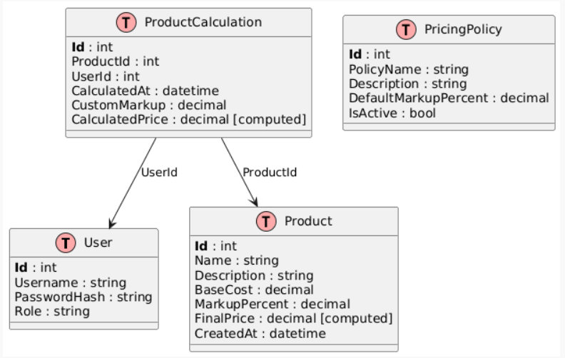
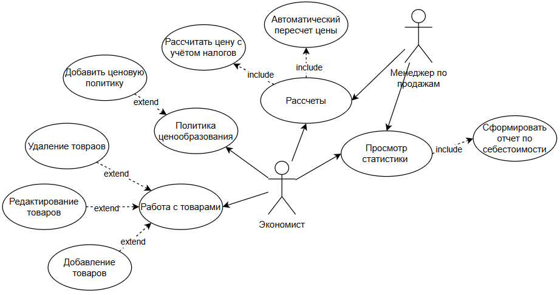
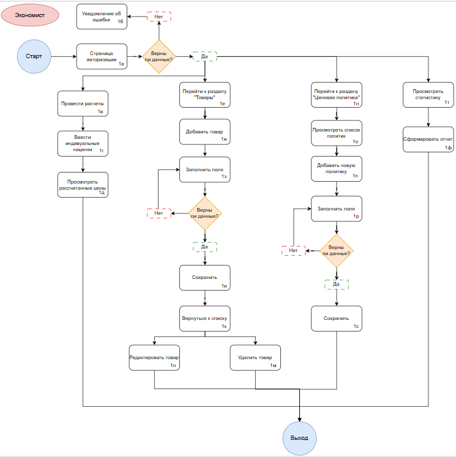
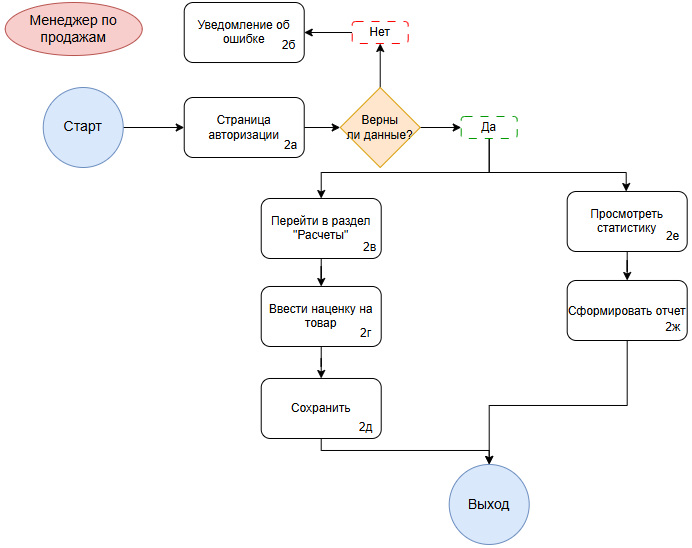
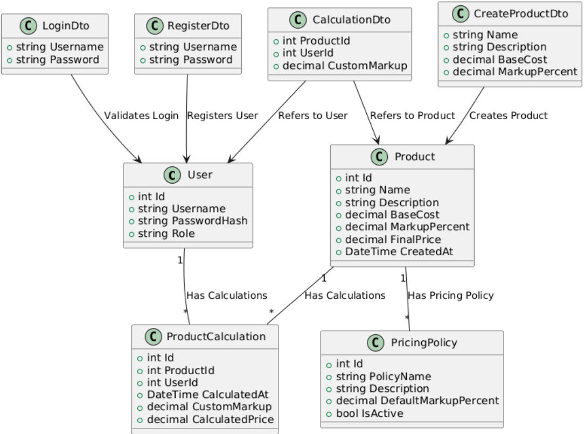
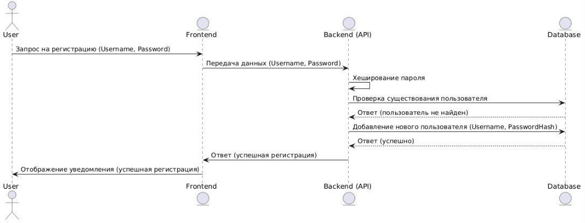
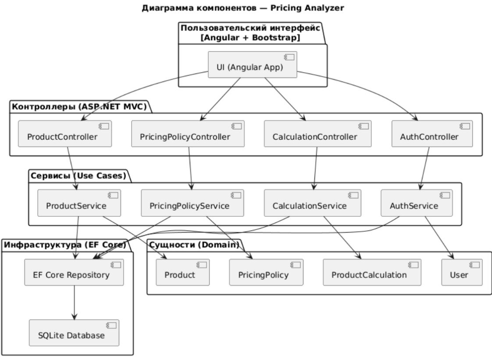

# **Программное средство анализа политики ценообразования продукции на предприятии и автоматизации расчетной методики**

Цель проекта — Оптимизация политики ценообразования предприятия за счёт автоматизации анализа рыночных данных, себестоимости продукции и конкурентной среды, что позволит повысить прибыльность, конкурентоспособность и обоснованность ценовых решений.

**Сервер**: [https://github.com/Ksenchez/OtyakovaK.A_214371_RIOPK_Server](https://github.com/Ksenchez/OtyakovaK.A_214371_RIOPK_Server)  
**Клиент**: [https://github.com/Ksenchez/OtyakovaK.A_214371_RIOPK_Front](https://github.com/Ksenchez/OtyakovaK.A_214371_RIOPK_Front)

---

## **Содержание**

1. [Архитектура](#архитектура)
2. [Функциональные возможности](#функциональные-возможности)
3. [Детали реализации](#детали-реализации)
4. [Тестирование](#тестирование)
5. [Установка и запуск](#установка-и-запуск)
6. [Лицензия](#лицензия)
7. [Контакты](#контакты)

---

## **Архитектура**

### C4-модель

#### Контекстный уровень


#### Контейнерный уровень


#### Компонентный уровень


#### Кодовый уровень


### Схема данных


```sql
-- SQL-скрипт для создания базы данных
namespace pricing_analyzer_back.Infrasctructure.Models.Dto
{
    public class CalculationDto
    {
        public int ProductId { get; set; }
        public int UserId { get; set; }
        public decimal CustomMarkup { get; set; }
    }
}

namespace pricing_analyzer_back.Infrasctructure.Models.Dto
{
    public class CreateProductDto
    {
        public string Name { get; set; } = default!;
        public string Description { get; set; } = default!;
        public decimal BaseCost { get; set; } // Себестоимость
        public decimal MarkupPercent { get; set; } // Наценка в %
    }
}

namespace pricing_analyzer_back.Infrasctructure.Models.Dto
{
    public class LoginDto
    {
        public string Username { get; set; }
        public string Password { get; set; }
    }
}

namespace pricing_analyzer_back.Infrasctructure.Models.Dto
{
    public class RegisterDto
    {
        public string Username { get; set; }
        public string Password { get; set; }
    }
}

using System.ComponentModel.DataAnnotations;

namespace pricing_analyzer_back.Infrasctructure.Models
{
    public class PricingPolicy
    {
        [Key]
        public int Id { get; set; }
        public string PolicyName { get; set; } = default!;
        public string Description { get; set; } = default!;
        public decimal DefaultMarkupPercent { get; set; } // Базовая наценка
        public bool IsActive { get; set; } = true;
    }
}

using System.ComponentModel.DataAnnotations;

namespace pricing_analyzer_back.Infrasctructure.Models
{
    public class Product
    {
        public int Id { get; set; }
        public string Name { get; set; } = default!;
        public string Description { get; set; } = default!;
        public decimal BaseCost { get; set; } // Себестоимость
        public decimal MarkupPercent { get; set; } // Наценка в %
        public decimal FinalPrice => BaseCost * (1 + MarkupPercent / 100);
        public DateTime CreatedAt { get; set; } = DateTime.UtcNow;
    }
}

using System.ComponentModel.DataAnnotations;

namespace pricing_analyzer_back.Infrasctructure.Models
{
    public class ProductCalculation
    {
        public int Id { get; set; }
        public int ProductId { get; set; }
        public Product Product { get; set; } = default!;
        public int UserId { get; set; }
        public User User { get; set; } = default!;
        public DateTime CalculatedAt { get; set; } = DateTime.UtcNow;
        public decimal CustomMarkup { get; set; } // Для собственной наценки
        public decimal CalculatedPrice => Product.BaseCost * (1 + CustomMarkup / 100);
    }
}

using System.ComponentModel.DataAnnotations;

namespace pricing_analyzer_back.Infrasctructure.Models
{
    public class User
    {
        public int Id { get; set; }
        public string Username { get; set; } = default!;
        public string PasswordHash { get; set; } = default!;
        public string Role { get; set; } = "user"; // "admin" / "user"
    }

}
```

---

## **Функциональные возможности**

### Диаграмма вариантов использования


### User-flow диаграмма






---

## **Детали реализации**

### UML-диаграммы

#### Диаграмма классов


#### Диаграмма последовательностей


#### Диаграмма компонентов


### Спецификация API

Открыть в браузере:  
[http://127.0.0.1:8000/docs](http://127.0.0.1:8000/docs)

OpenAPI YAML-файл: `openapi.json` генерируется автоматически.

### Безопасность

Использована JWT-аутентификация:
```python
from jose import jwt

def create_access_token(data: dict, expires_delta: timedelta = None):
    to_encode = data.copy()
    expire = datetime.utcnow() + (expires_delta or timedelta(minutes=ACCESS_TOKEN_EXPIRE_MINUTES))
    to_encode.update({"exp": expire})
    return jwt.encode(to_encode, SECRET_KEY, algorithm=ALGORITHM)
```

### Оценка качества кода

Анализ с использованием `flake8`, `pylint` и `radon`:
- Cyclomatic Complexity (radon): нормальный уровень
- Ошибки статики (`flake8`): отсутствуют
- Code Rating (`pylint`): > 8.0


---

## **Тестирование**

### Unit-тесты

Покрытие:
- Проверка хеширования пароля
- Проверка генерации токена
- Проверка корневого эндпоинта `/`
- Проверка `/me`
- Проверка обработки входа

Файл: `app/tests/test_unit_auth.py`
```python
def test_verify_password():
    assert verify_password("123", get_password_hash("123"))
```

### Интеграционные тесты

Файл: `app/tests/test_integration_auth.py`, `app/tests/test_integration_protected.py`
```python
def test_login_user():
    response = client.post("/login", data={"email": "test@example.com", "password": "test"})
    assert response.status_code == 200
```


---

## **Установка и запуск**

### Манифесты для сборки docker образов

Файл `Dockerfile`:
```dockerfile
FROM python:3.10
WORKDIR /app
COPY . .
RUN pip install --no-cache-dir -r requirements.txt
CMD ["uvicorn", "app.main:app", "--host", "0.0.0.0", "--port", "8000"]
```

### Манифесты для развертывания k8s кластера

Файл `deployment.yaml`:
```yaml
apiVersion: apps/v1
kind: Deployment
metadata:
  name: riopk-app
spec:
  replicas: 1
  selector:
    matchLabels:
      app: riopk
  template:
    metadata:
      labels:
        app: riopk
    spec:
      containers:
        - name: riopk
          image: riopk:latest
          ports:
            - containerPort: 8000
```

---

## **Лицензия**

Этот проект лицензирован по лицензии MIT – подробности в файле [LICENSE.md](LICENSE.md)

---

## **Контакты**

Автор: Иван Коцуба  
Email: deadpool.minsk.2016@gmail.com
